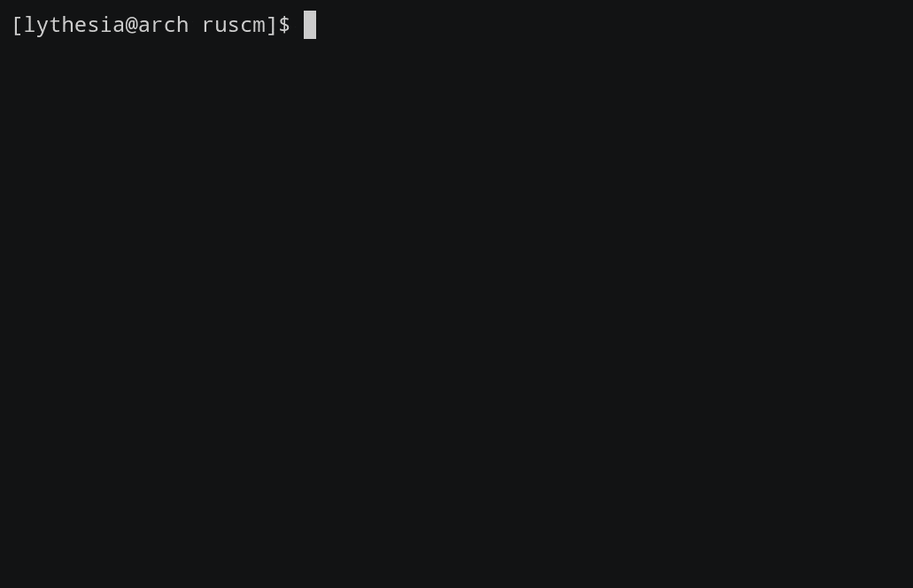

dont panic

### features

basis datum:
[x] integer(i64) & float(f64)
[x] char
[x] string
[x] boolean
[x] quasiquote & unquote
[ ] vector
[ ] rational
[ ] complex
[ ] bignum

macro:
[x] hygiene
[x] pattern matching 
[ ] nested ellipsis

[x] call/cc
[x] basic primitives
[ ] lib support: `load`
